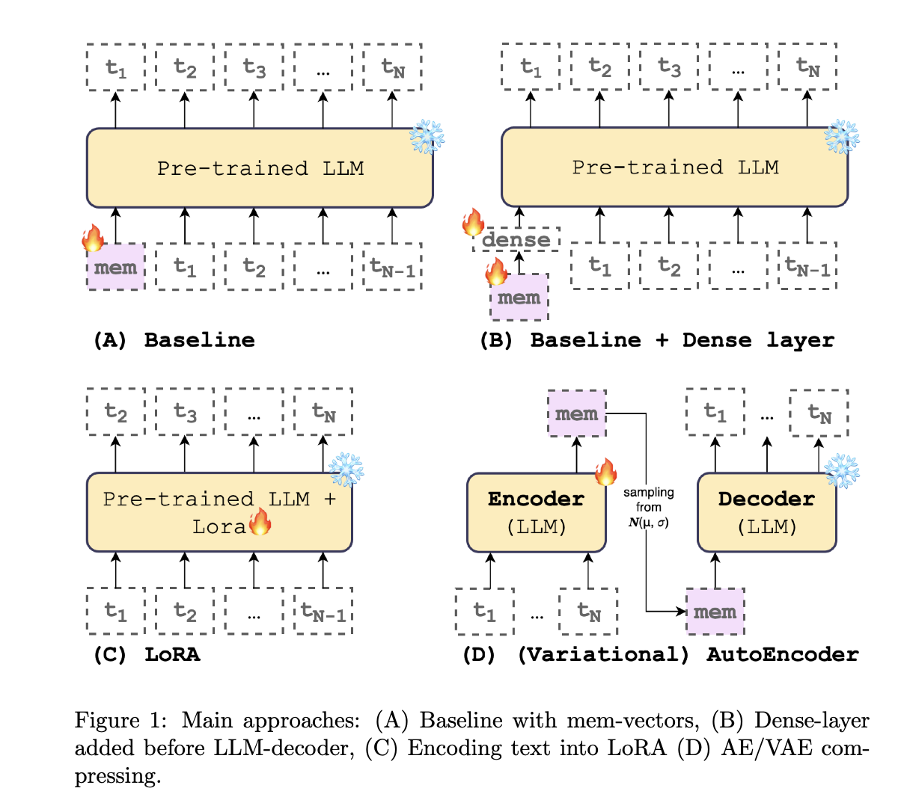

# Leveraging LLM Embeddings Space Capacity(Dense, LoRA, AE/VAE approaches)
This repository contains our experiments with LLM context compression on AIRI 2025 Summer School



## Scripts
- `scripts/run.*.sh` - bash scripts for different models, they include running experiments on PG-19, fanfics, and random texts with single or multiple trainable input `[mem]` vectors.
- pythia_avtoencoder.py - file with vanilla autoencoder pipeline
- pythia_vae2.py - file with VAE pipeline

## Visualizations
- `notebooks/` - Folder with notebooks used for visualizations and collecting results.
- `notebooks/ablation_analyze_results.ipynb` - Table 1, Figure 3, Figure 6. Analysis of compression, capacity in tokens, capacity in terms of entropy.
- `notebooks/plot_length_model_brief.ipynb` - Figure 1, text compression results on PG-19.
- `notebooks/plot_length_vs_n_mem_tokens.ipynb` - Figure 4, scaling compression and number of trainable `[mem]` vectors.
- `notebooks/plot_model_theor_capacity_vs_actual.ipynb` - Figure 5, Theoretical capacity vs empirical.
- notebooks with `add_mamba` suffix add results for Mamba (130m, 370m, 790m, 1.4b) models.

## Data
### Downloading Preprocessed Data

To quickly get started, you can download our preprocessed text chunks for PG-19 and fanfics with a single command:

```bash
cd ./data
./download_texts.sh
```

This script will fetch the required texts and place them in the `./data` folder.

## Run pipelines
This section describes how to run our code

To setup:

```bash
conda env create -n my_env -f conda_env.yaml
conda activate my_env

```
To run AE/VAE training pipelines:

```bash
python pythia_avtoencoder.py
python pythia_vae2.py
```

This script will fetch the required texts and place them in the `./data` folder.


